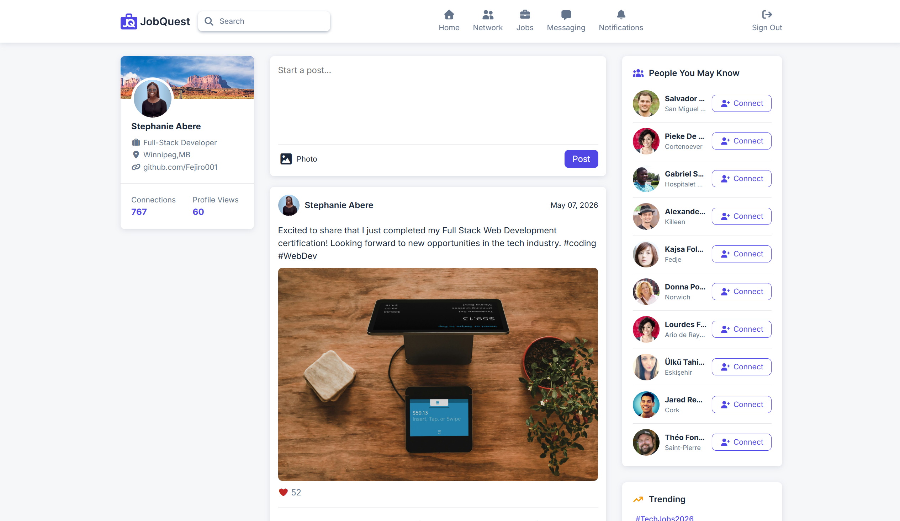

# JobQuest



## Description

**JobQuest** is a professional networking and job finder web application inspired by platforms like LinkedIn. The application allows users to connect with professionals, create posts, explore trending topics, and discover people they may know through dynamic data fetched from the Random User API.

The project was built as part of the Introduction to Third-Party APIs course and focuses on modern front-end development practices, semantic HTML structure, API integration, dynamic DOM manipulation, and responsive user interface design.

## Features

- User login system using `localStorage`
- Dynamic homepage with a 3-column social media layout
- Fetches random users using the Random User API
- “People You May Know” connection section
- Create and display user posts dynamically
- Upload images with posts
- Interactive connect buttons
- Trending topics section
- News feed section
- Modern and professional UI design
- Semantic and accessible HTML structure
- Responsive mobile layout

## Technologies Used

### Front-End

- HTML5
- CSS3
- JavaScript (Vanilla)

### Tools Used

- VS Code
- Git
- GitHub

## Key Implementation Details

### API Integration

The application uses the Random User API to dynamically generate user profiles for the “People You May Know” section.

```js
async function getUsers(endpointURL) {
  try {
    const result = await fetch(endpointURL, options);
    const data = await result.json();
    return data.results;
  } catch (error) {
    console.error(error.message);
  }
}

async function addUsers() {
  const users = await getUsers(randomUserURL);

  users.forEach((user) => {
    const userInfo = `
      <li>
        <div class="person-list-item">
          <div class="person-image">
            
          </div>
          <div class="person-info">
            <h3>${user.name.first} ${user.name.last}</h3>
            <p>${user.location.city}</p>
          </div>
        </div>
        <button class="connect-btn button secondary-button">
          <i class="fa-solid fa-user-plus"></i>Connect
        </button>
      </li>`;

    usersList.insertAdjacentHTML("beforeend", userInfo);
  });
}
```

## Team Members

- Oghenefejiro Stephanie Abere
- Blake Thompson

## Demo

Click [here]() to demo
